# PTFuse: Prompt-Guided Third-Party Modality Exploration

<p align="center">
  <a href="https://ieeexplore.ieee.org/abstract/document/11598884">
    
  </a>
  <a href="README_CN.md">
    
  </a>
  
  
</p>

This repository provides the **official implementation** of:

> **PTFuse: Prompt-Guided Third-Party Modality Exploration for Infrared-Visible Image Fusion**

The paper is published in the **IEEE Internet of Things Journal (IOTJ)**.

- **Paper:** [IEEE Xplore](https://ieeexplore.ieee.org/abstract/document/11598884)
- **中文说明:** [`README_CN.md`](README_CN.md)

## Overview

PTFuse treats an infrared-visible fused image as a distinct **third-party modality**
rather than as a simple pixel- or feature-level mixture of the two source images.
The framework contains two principal components:

- **TeMAL — Text-Guided Modality-aware Adversarial Learning:** uses CLIP text
  prompts to provide global semantic specifications and modality-aware adversarial
  supervision.
- **PATS — Patch-Aware Triplet Supervision:** identifies high-information local
  patches and suppresses deceptive pseudo-fused patterns caused by spatially
  mismatched infrared-visible pairs.

The implementation is organized as follows:

```text
model/PTFuse/
├── model.py       # PTFuse training and inference pipeline
├── network.py     # PTFuseGenerator, TeMAL, and modality discriminators
└── loss.py        # Fusion loss and PATS
```

## Method at a Glance

The following figures are reproduced from the paper to summarize the proposed
architecture and its main components.

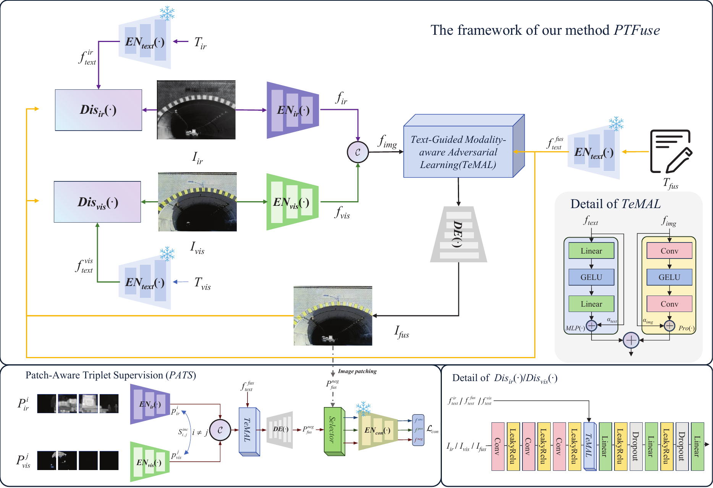

*Overall PTFuse framework, including the prompt-guided adversarial branch and
patch-aware triplet supervision.*

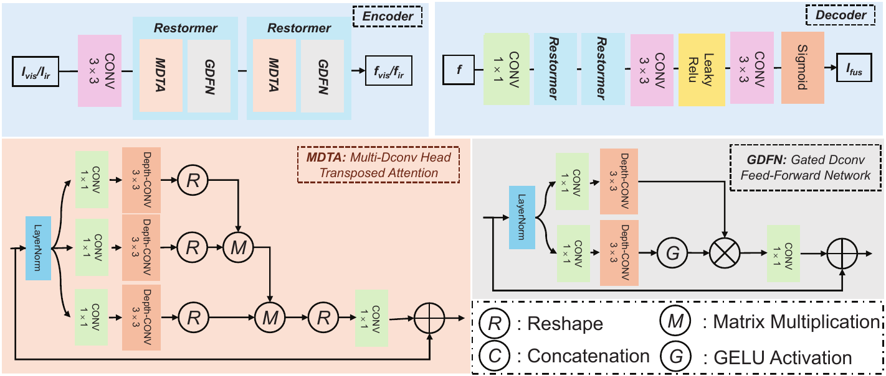

*Encoder-decoder path used to construct the fused third-party modality.*

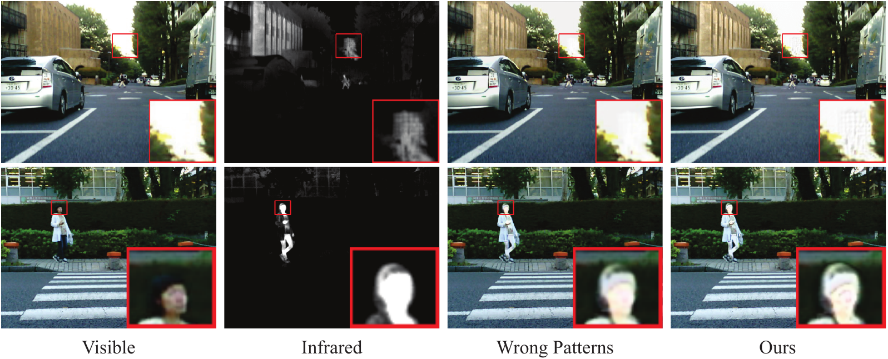

*PATS motivation: spatially misaligned source pairs can produce deceptive
pseudo-fused patterns, which are suppressed by patch-aware supervision.*

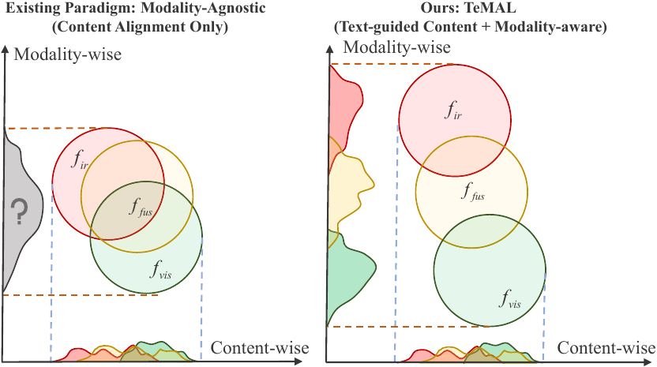

*TeMAL introduces text-guided modality awareness into adversarial learning.*

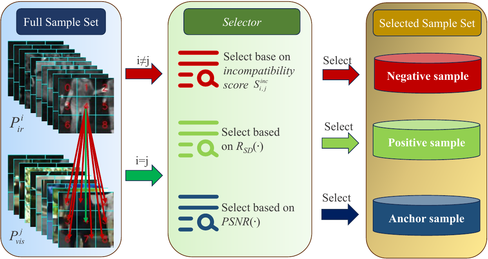

*PATS identifies and filters locally incompatible third-party modality patterns.*

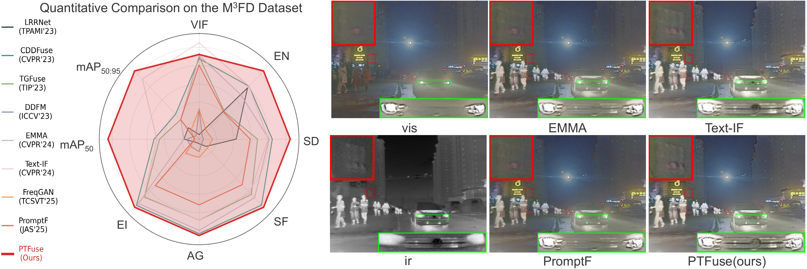

*Top figure from the paper: quantitative and qualitative comparison illustrating
the distinct third-party modality produced by PTFuse.*

## Environment

The commands below are independent of the repository author's machine. Python
3.12 is recommended; use an isolated environment rather than a global
installation:

```bash
conda create -n ptfuse python=3.12 -y
conda activate ptfuse
```

Install the important runtime dependencies:

```bash
python -m pip install -r requirements.txt
```

For NVIDIA GPUs, install the PyTorch build matching the driver from the
[official selector](https://pytorch.org/get-started/locally/) before installing
the remaining requirements. The following versions were used for verification:

| Component | Version |
|---|---:|
| Python | 3.12.4 |
| PyTorch | 2.4.1+cu118 |
| torchvision | 0.19.1+cu118 |
| CUDA runtime | 11.8 |
| NumPy | 1.26.4 |
| OpenCV | 4.10.0 |
| Kornia | 0.8.0 |
| einops | 0.8.0 |
| CLIP | 1.0 |

The repository includes the important Python dependencies in
[`requirements.txt`](requirements.txt). CPU execution is supported, but CLIP
training and inference are substantially slower.

The CLIP `ViT-B/32` weights are downloaded on first use. Internet access or a
pre-populated CLIP cache is therefore required. The vector figure originals and
GitHub-renderable previews are available in [`figs/`](figs/).

## Datasets

The paper evaluates PTFuse on the following public infrared-visible datasets:

| Dataset | Protocol |
|---|---|
| MSRS | Training and in-domain testing; 361 test pairs are reported in the paper |
| FMB | Cross-dataset testing; 280 pairs are reported in the paper |
| M3FD | Cross-dataset testing; 300 pairs are reported in the paper |

For the paper protocol, the dataset set is:

```python
choices = ["MSRS", "FMB", "M3FD"]
```

This describes the datasets used in the paper; it does not imply that every
dataset loader is already implemented in `libs/data.py`. Check the loader before
running a new dataset.

A typical MSRS layout is:

```text
data/
└── MSRS/
    ├── train/
    │   ├── ir/
    │   └── vi/
    └── test/
        ├── ir/
        └── vi/
```

The exact directory names are determined by [`libs/data.py`](libs/data.py).

The prompt option accepts `discussion`; omit it or pass `None` to disable text
prompts. The corresponding `discussion.txt` file must be placed in each dataset
split directory when text guidance is enabled.

## Training

The paper uses 96x96 random crops, batch size 2, 100 epochs, and AdamW with a
learning rate of `1e-4`. PATS uses patch size 32, `K_pos=2`, `K_neg=8`, and
temperature `0.1`.

Run from the repository root:

```bash
python main.py PTFuse \
  --data MSRS \
  --phase train \
  --batch_size 2 \
  --epochs 100 \
  --aug_methods random_crop RVF RHF \
  --convert_mode RGB \
  --prompt discussion \
  --control_save \
  --control_save_weights \
  --control_save_img
```

## Testing

```bash
python main.py PTFuse \
  --data MSRS \
  --phase test \
  --batch_size 1 \
  --prompt discussion \
  --control_save \
  --control_save_img \
  --convert_mode RGB
```

Before testing, provide a trained checkpoint in the default output directory
or pass its path through `--weight_path`.

## Evaluation Metrics

Metric computation is intentionally kept outside the PTFuse training and
inference pipeline. If quantitative evaluation is required, please refer to
the metric implementations and evaluation protocols in:

- [RollingPlain/IVIF_ZOO](https://github.com/RollingPlain/IVIF_ZOO)
- [Zhaozixiang1228/MMIF-CDDFuse](https://github.com/Zhaozixiang1228/MMIF-CDDFuse)

When comparing results, use the same dataset split, image conversion,
normalization, metric implementation, and official checkpoint protocol.

## Results

The following tables reproduce the paper in its original order. Bold values
retain the paper's emphasis for the strongest reported results. For reproducible
comparisons, use the same splits, preprocessing, metric implementations, and
checkpoints described above.

### Fusion quality

| Method | MSRS VIF | EN | SD | SF | AG | EI | FMB VIF | EN | SD | SF | AG | EI | M3FD VIF | EN | SD | SF | AG | EI |
|---|---:|---:|---:|---:|---:|---:|---:|---:|---:|---:|---:|---:|---:|---:|---:|---:|---:|---:|
| LRRNET | 0.7236 | 6.4892 | 31.3504 | 8.2310 | 2.7617 | 30.2906 | 0.5419 | **6.9866** | 37.2790 | 8.8374 | 2.5663 | 29.5013 | 0.4985 | 6.8867 | 33.4752 | 9.6114 | 2.9925 | 33.2738 |
| CDDFuse | 1.0483 | 6.7140 | 42.9293 | 11.8850 | 3.9229 | 43.2560 | 0.9008 | 6.7348 | 35.9329 | **14.9651** | **4.4930** | **49.7972** | 0.8208 | 6.8925 | **36.7622** | **15.7059** | **5.2088** | **56.1677** |
| TGFuse | 0.9582 | 6.6334 | 42.9980 | 11.4786 | 3.7120 | 41.1441 | 0.8848 | 6.6099 | 31.7239 | 14.1567 | 4.2269 | 47.3300 | 0.8306 | 6.8018 | 35.4164 | 14.5933 | 4.8781 | 53.1044 |
| DDFM | 0.7412 | 6.1748 | 28.9167 | 7.3869 | 2.5132 | 28.0338 | 0.1034 | 6.6429 | 30.5530 | 9.1393 | 2.8264 | 31.6613 | 0.6083 | 6.7181 | 30.4924 | 9.1932 | 3.1877 | 34.9672 |
| DDBF | 0.8618 | 6.7352 | 41.1642 | **12.5340** | 3.7184 | 43.7947 | 0.4570 | 5.2717 | 28.2674 | 14.1312 | 3.6106 | 42.2812 | 0.4861 | 5.2895 | 21.5328 | 14.4942 | 3.9543 | 44.9443 |
| EMMA | 1.0229 | 6.7198 | **43.9853** | 11.6032 | 3.7766 | 41.9874 | 0.9144 | 6.7184 | 35.1061 | 14.1326 | 4.3875 | 48.9074 | 0.8341 | 6.8621 | 36.4675 | 14.9450 | 5.1278 | 55.4609 |
| Text-IF | **1.0775** | **6.7866** | 42.9689 | 11.4112 | 3.7790 | 42.0606 | **0.9353** | 6.6954 | 35.0029 | 12.9427 | 4.0058 | 45.4567 | **0.8884** | **6.8927** | 36.3843 | 14.4388 | 4.8766 | 53.3129 |
| FreqGAN | 0.7965 | 6.5327 | 41.2643 | 10.1768 | 3.1750 | 35.7695 | 0.6460 | 6.6970 | 32.0891 | 9.9226 | 2.9573 | 34.1592 | 0.6052 | 6.7340 | 31.3295 | 9.7806 | 3.3265 | 37.3263 |
| TextFusion | 0.8560 | 6.6345 | **44.3498** | 10.6853 | 3.4219 | 39.5173 | 0.8213 | 6.5024 | 29.5681 | 14.4248 | 4.2427 | 48.0408 | 0.6510 | 6.5874 | 32.2531 | 14.5583 | 4.6458 | 51.1245 |
| PromptF | 1.0222 | 6.6409 | 42.2438 | 11.0906 | 3.5051 | 39.1930 | 0.8740 | 6.6264 | 33.5350 | 13.7437 | 4.0463 | 45.1289 | 0.7933 | 6.7997 | 34.7527 | 13.5858 | 4.4993 | 48.9796 |
| **PTFuse (Ours)** | **1.0866** | **6.8006** | 44.0214 | 11.9349 | **3.9808** | **44.3087** | 0.9156 | 6.8231 | **38.3918** | **15.1448** | **4.5268** | **50.5642** | 0.8384 | **6.9463** | **38.3980** | **15.9305** | **5.2539** | **56.8797** |

### Downstream object detection on M3FD

| Method | People AP50 | Car | Bus | Lamp | Moto | Truck | All AP50 | People AP50:95 | Car | Bus | Lamp | Moto | Truck | All AP50:95 |
|---|---:|---:|---:|---:|---:|---:|---:|---:|---:|---:|---:|---:|---:|---:|
| Visible | 0.732 | 0.920 | 0.923 | 0.798 | 0.794 | 0.888 | 0.842 | 0.382 | 0.658 | 0.757 | 0.430 | 0.394 | 0.615 | 0.539 |
| Infrared | 0.825 | 0.890 | 0.873 | 0.677 | 0.730 | 0.854 | 0.808 | 0.495 | 0.621 | 0.729 | 0.289 | 0.378 | 0.583 | 0.516 |
| LRRNET | 0.815 | 0.910 | 0.911 | 0.820 | 0.779 | 0.878 | 0.852 | 0.473 | 0.657 | 0.764 | 0.406 | 0.406 | 0.628 | 0.556 |
| CDDFuse | 0.815 | 0.919 | 0.915 | 0.821 | 0.808 | 0.900 | 0.863 | 0.482 | 0.661 | 0.774 | 0.415 | 0.404 | 0.630 | 0.561 |
| TGFuse | 0.808 | 0.920 | 0.930 | 0.835 | 0.800 | 0.872 | 0.861 | 0.478 | 0.668 | 0.773 | 0.427 | 0.410 | 0.597 | 0.559 |
| DDFM | 0.800 | 0.915 | 0.909 | 0.827 | 0.788 | 0.870 | 0.851 | 0.469 | 0.658 | 0.764 | 0.410 | 0.393 | 0.626 | 0.553 |
| DDBF | 0.754 | 0.909 | 0.926 | 0.804 | 0.753 | 0.855 | 0.834 | 0.407 | 0.645 | 0.735 | 0.397 | 0.362 | 0.596 | 0.524 |
| EMMA | 0.811 | 0.916 | 0.905 | 0.815 | 0.786 | 0.876 | 0.852 | 0.473 | 0.661 | 0.752 | 0.405 | 0.425 | **0.638** | 0.559 |
| Text-IF | 0.805 | 0.918 | **0.936** | 0.818 | 0.806 | 0.892 | 0.862 | 0.478 | 0.666 | **0.782** | 0.429 | **0.448** | **0.637** | 0.574 |
| FreqGAN | 0.830 | 0.911 | 0.922 | 0.807 | 0.743 | 0.872 | 0.848 | 0.489 | 0.658 | 0.775 | 0.386 | 0.401 | 0.622 | 0.555 |
| TextFusion | 0.764 | 0.915 | 0.930 | 0.825 | 0.785 | 0.876 | 0.849 | 0.418 | 0.657 | 0.772 | 0.427 | 0.383 | 0.621 | 0.546 |
| PromptF | 0.813 | 0.914 | 0.906 | 0.792 | 0.771 | 0.894 | 0.848 | 0.473 | 0.659 | 0.773 | 0.411 | 0.417 | 0.619 | 0.559 |
| **PTFuse (Ours)** | **0.830** | **0.928** | 0.931 | **0.855** | **0.848** | 0.890 | **0.880** | **0.498** | **0.677** | 0.772 | **0.438** | 0.438 | 0.619 | **0.577** |

### Downstream semantic segmentation

| Method | FMB background | sidewalk | lamp | vegetation | person | car | bus | FMB mIoU | MSRS unlabelled | car | person | bike | curve | car_stop | bump | MSRS mIoU |
|---|---:|---:|---:|---:|---:|---:|---:|---:|---:|---:|---:|---:|---:|---:|---:|---:|
| Visible | 16.51 | 47.86 | 32.86 | 84.72 | 50.73 | 79.47 | 33.19 | 53.31 | 98.35 | 89.69 | 62.11 | 72.19 | 60.47 | 76.16 | 76.27 | 75.77 |
| Infrared | 14.54 | 32.86 | 28.34 | 82.46 | 63.97 | 76.66 | 19.45 | 50.61 | 98.27 | 88.22 | 69.95 | 69.47 | 58.78 | 70.58 | 75.71 | 72.21 |
| LRRNET | 15.21 | 48.89 | 38.68 | 85.94 | 62.69 | 78.10 | 18.39 | 56.01 | 98.53 | 90.14 | 72.02 | 71.14 | 63.20 | 76.33 | 78.34 | 76.38 |
| CDDFuse | **16.99** | **49.98** | 39.19 | 86.05 | 62.29 | 79.06 | 22.80 | 52.90 | 98.17 | 87.66 | 68.99 | 65.22 | 48.44 | 68.59 | 72.89 | 70.66 |
| TGFuse | 15.01 | 48.62 | 36.04 | 85.98 | 63.76 | 79.45 | 25.72 | 54.25 | 98.48 | 89.80 | 71.02 | 71.76 | 61.33 | 74.43 | 79.08 | 76.60 |
| DDFM | 14.16 | 44.30 | 37.30 | 85.46 | 59.06 | 76.77 | 26.93 | 54.98 | 98.53 | 90.16 | 71.73 | 71.94 | 62.17 | 77.24 | **80.23** | 77.23 |
| DDBF | 16.67 | 45.96 | 35.29 | 83.94 | 55.22 | 79.79 | 33.51 | 56.78 | 98.46 | 89.78 | 69.32 | 72.15 | 61.09 | 73.85 | 79.58 | 76.65 |
| EMMA | 15.99 | 47.10 | 33.84 | 85.43 | 62.54 | 78.88 | 27.31 | 56.63 | 98.56 | **90.80** | 71.92 | 72.26 | 62.58 | 77.83 | 80.03 | **77.93** |
| Text-IF | 16.11 | 48.44 | **39.37** | 85.98 | 64.04 | 80.49 | 19.86 | **57.83** | 98.55 | 90.07 | **72.29** | **72.31** | 63.54 | 77.76 | 79.53 | 77.48 |
| FreqGAN | 16.15 | 47.08 | 38.97 | **86.36** | 63.09 | 77.47 | 28.15 | 56.45 | 98.51 | 90.45 | 71.67 | 71.67 | 60.74 | 76.06 | 77.04 | 77.25 |
| TextFusion | 15.88 | 47.90 | 37.88 | 84.91 | 60.30 | 80.80 | 29.08 | 53.92 | 98.49 | 89.78 | 69.74 | 71.62 | 61.81 | 77.12 | 78.84 | 76.94 |
| PromptF | 16.29 | 49.93 | 36.11 | 85.50 | 63.94 | 79.07 | 22.41 | 56.37 | 98.52 | 90.26 | 71.48 | 71.62 | 62.10 | 77.08 | 79.84 | 77.08 |
| **PTFuse (Ours)** | 16.68 | 49.96 | 39.34 | 86.10 | **65.74** | **82.28** | **59.66** | **60.42** | **98.57** | 90.28 | 72.22 | 71.81 | **63.64** | **78.03** | 79.00 | 77.57 |

### Ablation study on MSRS

The paper reports both TeMAL (I-III) and PATS (IV-VII) ablations:

| Ablation | VIF | EN | SD | SF | AG | EI |
|---|---:|---:|---:|---:|---:|---:|
| I (Sum; TeMAL) | 1.0685 | 6.7274 | 43.7134 | 11.5918 | 3.8561 | 43.3514 |
| II (No `T_fus`; TeMAL) | 1.0813 | 6.7672 | 43.5012 | 11.5945 | 3.9245 | 43.7581 |
| III (No `T_img`; TeMAL) | 1.0740 | 6.7393 | 43.4647 | 11.8038 | 3.8448 | 43.7312 |
| IV (No contrastive loss; PATS) | 1.0791 | 6.7587 | 43.2963 | 11.6623 | 3.8697 | 42.9804 |
| V (Global PATS) | 1.0820 | 6.7979 | 43.8675 | 11.8669 | 3.9299 | 43.6544 |
| VI (Random sampling; PATS) | 1.0720 | 6.7618 | 42.9084 | 11.6193 | 3.8657 | 42.8980 |
| VII (Global + random; PATS) | 1.0846 | 6.7738 | 43.6918 | 11.5475 | 3.8321 | 42.6119 |
| **PTFuse (Ours)** | **1.0866** | **6.8006** | **44.0214** | **11.9349** | **3.9808** | **44.3087** |

### Qualitative Results

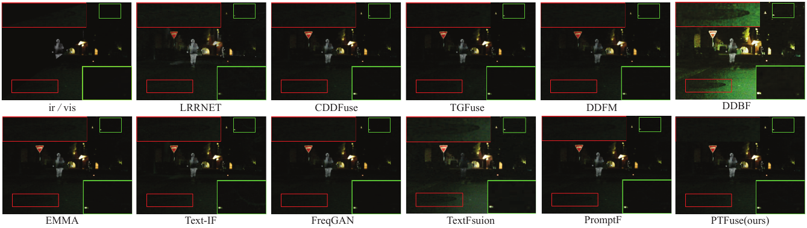

*Low-light fusion comparison on MSRS.*

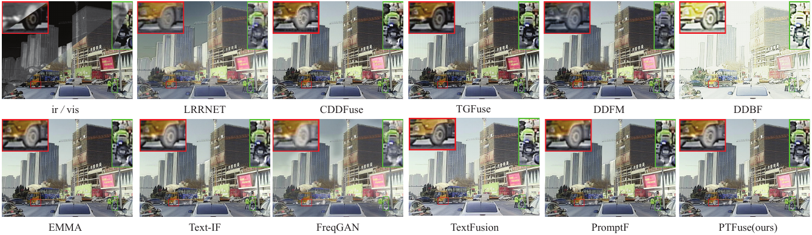

*Cross-dataset fusion comparison on FMB.*

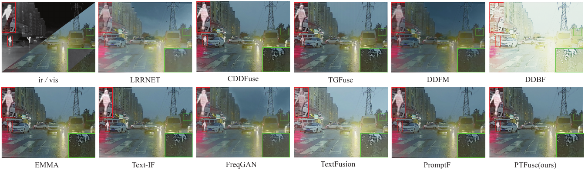

*Rainy-scene fusion comparison on M3FD.*

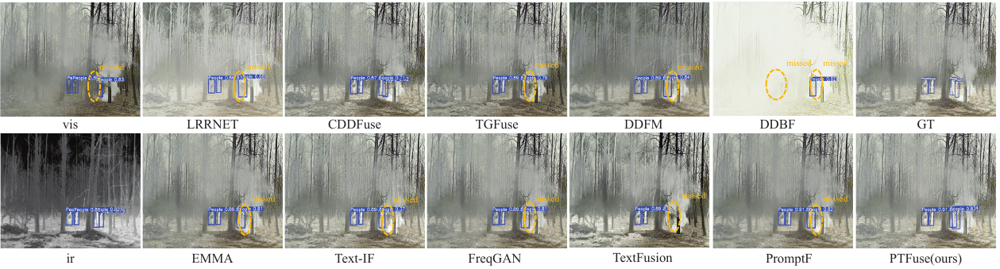

*Downstream object-detection comparison on M3FD.*

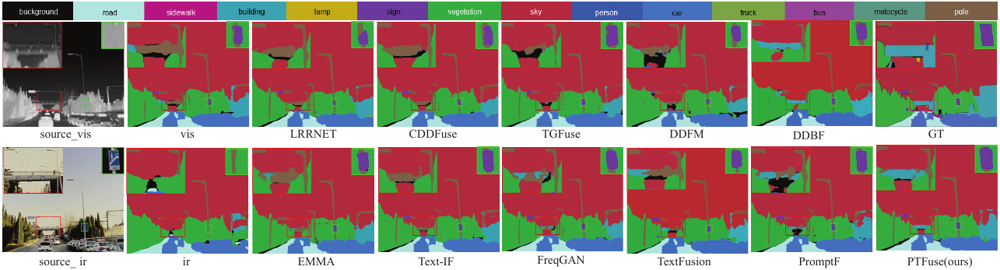

*Downstream semantic-segmentation comparison on FMB.*

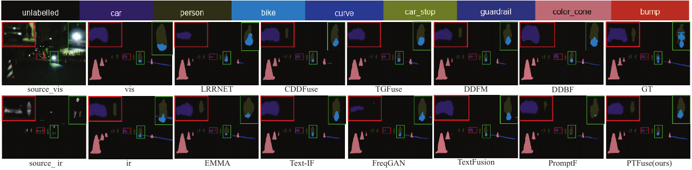

*Downstream semantic-segmentation comparison on MSRS.*

## Visualization

The project supports saving fused images and optional feature, attention, filter,
and monitoring visualizations. Relevant switches are exposed by `libs/opt.py`,
including `--control_print`, `--control_save`, `--control_save_img`,
`--control_save_img_type`, and `--control_monitor`.

To enable Visdom:

```bash
python -m visdom.server -p 8097
```

Then run the experiment with `--control_monitor 1`.

## Citation

If you use this code or PTFuse in your research, please cite the IOTJ paper:

```bibtex
@article{liu2026ptfuse,
  title   = {PTFuse: Prompt-Guided Third-Party Modality Exploration for Infrared-Visible Image Fusion},
  author  = {Liu, Jianpu and Yang, Yang and Lang, Yue and Miao, Di and Chen, Mo},
  journal = {IEEE Internet of Things Journal},
  year    = {2026},
  url     = {https://ieeexplore.ieee.org/abstract/document/11598884}
}
```
If you have any questions, please contact me via email: liujianpu@tju.edu.cn.

## Acknowledgements

We thank the authors and maintainers of the comparison methods and their public
implementations. The original publications used in the paper are listed below;
please cite the corresponding work when using or comparing with these methods:

- **LRRNET** — TPAMI 2023. [Paper](https://ieeexplore.ieee.org/document/10105495)
- **CDDFuse** — CVPR 2023. [Paper](https://openaccess.thecvf.com/content/CVPR2023/html/Zhao_CDDFuse_Correlation-Driven_Dual-Branch_Feature_Decomposition_for_Multi-Modality_Image_Fusion_CVPR_2023_paper.html)
- **TGFuse** — TIP 2023. [Paper](https://ieeexplore.ieee.org/document/10122870)
- **DDFM** — ICCV 2023. [Paper](https://openaccess.thecvf.com/content/ICCV2023/html/Zhao_DDFM_Denoising_Diffusion_Model_for_Multi-Modality_Image_Fusion_ICCV_2023_paper.html)
- **DDBF** — CVPR 2024. [Paper](https://openaccess.thecvf.com/content/CVPR2024/html/Zhang_Dispel_Darkness_for_Better_Fusion_A_Controllable_Visual_Enhancer_based_CVPR_2024_paper.html)
- **EMMA** — CVPR 2024. [Paper](https://openaccess.thecvf.com/content/CVPR2024/html/Zhao_Equivariant_Multi-Modality_Image_Fusion_CVPR_2024_paper.html)
- **Text-IF** — CVPR 2024. [Paper](https://openaccess.thecvf.com/content/CVPR2024/html/Yi_Text-IF_Leveraging_Semantic_Text_Guidance_for_Degradation-Aware_and_Interactive_Image_CVPR_2024_paper.html)
- **FreqGAN** — TCSVT 2025. [Paper](https://ieeexplore.ieee.org/document/10680110)
- **TextFusion** — Information Fusion 2025. [Paper](https://doi.org/10.1016/j.inffus.2025.103046)
- **PromptF** — JAS 2025. [Paper](https://ieeexplore.ieee.org/document/10815008)

The complete bibliographic records are maintained in the paper source file
`bare_jrnl_new_sample4.tex` and its bibliography.
